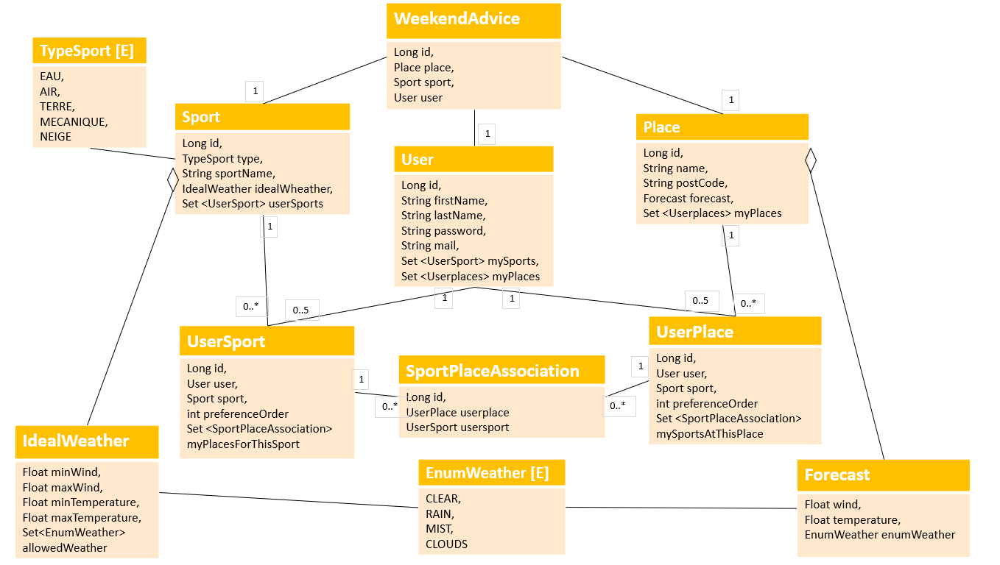

# Our understanding of the subject

We designed an app that allows the users to choose places and outdoor sports from a list and then organize them according to their preference order. Users have the possibility to associate one sport to many places and one place to many sports. They can reorganize the lists as they want (change the preference for each item, delete some etc.).

A place is mainly a town name and a zip code located in France.
Each sport is associated with an IdealWeather i.e. the weather required to practice this outdoor sport.

The algorithm for week-end advice is "place-first": if the wheather is good enough to practice a sport (even the lower-ranked one) in the top-ranked place, this advice will be given to the user.

## UML diagramm

## Our main difficulties
One of the difficulties at the very beginning of the project was to design the data model and the REST controllers without thinking about the interface and users' input. These two dimensions are really intricated which finally requires several interaction to ended up with something working properly (for both back and front).

Finding the documentation to use Spring Security and Docker was quite difficult as well. Even though we had some practice classes related to these two technologies, we faced difficulties in finely understanding them and using them properly.

## Our main achievements
We managed to develop a complete and functional application including some security dimensions and connection to home-made and online web services. Most of the user inputs are checked both in frontend and backend to ensure application robustness. We provide a Docker version of our app to make it portable and steady over time.

We also managed to organize and share our work within the team. We met on a regular basis to take stock and dispatch the tasks. Slack was a good tool to communicate night and day, seven day a week.   

## Work organization

* **Michel Perucca**: the guy who loves Spring and Docker. Spent his evenings in the lovely company of Spring Security! 
* **Dorian Screm**: the front designer and boss of React. Has become an expert in SportPlaceAssociation!
* **Angélique Montuwy**: the girl who draws diagramms and loves the places management. The one who try to write jokes in this file on the behalf of her two colleagues! 

